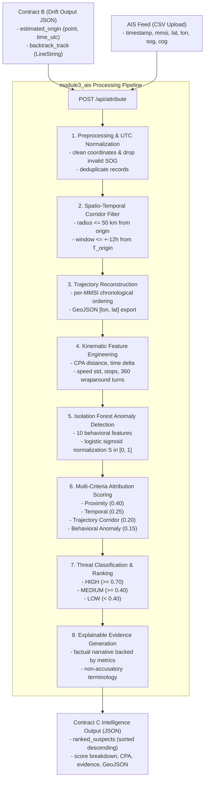

# Module 3: AIS & Intelligence Engine (Vessel Attribution)

**SIH Problem Statement 26143**  
Autonomous marine vessel attribution engine correlating reverse Lagrangian oil spill backtrack origins (Contract B) with terrestrial/satellite AIS feeds to identify, rank, and generate explainable evidence against potential suspect ships.

---

## 1. System Architecture & Pipeline Flow



---

## 2. Directory Structure

```text
module3_ais/
├── README.md                 # Architecture, API specifications, and usage guide
├── requirements.txt          # Package dependencies (FastAPI, scikit-learn, pandas, etc.)
├── __init__.py               # Package exports and version identifier (0.3.0)
├── config.py                 # Hyperparameters, physical limits, scoring weights, and validation
├── schemas.py                # Pydantic data schemas for Contract B and Contract C
├── preprocessor.py           # AIS loading, UTC normalization, data cleaning, and Haversine filtering
├── trajectory.py             # Chronological trajectory assembly and GeoJSON formatting
├── features.py               # 14-column feature extraction, 360° wraparound, and cross-track calculations
├── anomaly_model.py          # Isolation Forest behavioral anomaly detection and score normalization
├── attribution_engine.py     # Multi-criteria scoring, threat classification, and candidate ranking
├── evidence_generator.py     # Explainable evidence packaging and non-accusatory legal summaries
├── validate_schema.py        # Strict Contract C schema and GeoJSON validator
├── api.py                    # Production FastAPI application serving /health and /api/attribute
├── data/
│   └── synthetic_ais.csv     # Benchmark AIS dataset with dirty records and edge cases
└── tests/                    # Comprehensive unit and integration test suite (55 tests)
    ├── __init__.py
    ├── test_preprocessor.py  # Phase 1 tests (loading, cleaning, Haversine, filtering)
    ├── test_features.py      # Phase 2 tests (trajectories, wraparound, corridor distance)
    ├── test_anomaly_model.py # Phase 3 tests (Isolation Forest, NaN safety, small populations)
    ├── test_attribution_scoring.py # Phase 3 tests (scoring, ranking, weight validation)
    ├── test_evidence_generator.py  # Phase 3 tests (factual evidence, non-accusatory language)
    └── test_api.py           # Phase 4 tests (FastAPI endpoints, CORS, errors, integration)
```

---

## 3. Installation

Ensure you have a Python 3.10+ environment:

```bash
pip install -r module3_ais/requirements.txt
```

---

## 4. Running the API

Start the FastAPI application with Uvicorn:

```bash
uvicorn module3_ais.api:app --host 0.0.0.0 --port 8000 --reload
```

Interactive API documentation will be automatically accessible at:
- **Swagger UI**: [http://localhost:8000/docs](http://localhost:8000/docs)
- **ReDoc**: [http://localhost:8000/redoc](http://localhost:8000/redoc)
- **OpenAPI JSON**: [http://localhost:8000/openapi.json](http://localhost:8000/openapi.json)

---

## 5. API Endpoints

### A. Health Check
`GET /health`

**Response (`200 OK`)**:
```json
{
  "status": "ok",
  "module": "member3_ais",
  "version": "0.3.0"
}
```

### B. Vessel Attribution
`POST /api/attribute`

**Request Parameters (`multipart/form-data`)**:
- `ais_file` (`UploadFile`, Required): CSV file containing raw or preprocessed AIS messages.
- `contract_b` (`string`, Required): Contract B JSON string produced by Member 2 drift model.

#### Expected AIS CSV Columns
The uploaded CSV must include (case-insensitive column synonyms supported):
| Column | Description |
| :--- | :--- |
| `timestamp` | ISO-8601 UTC timestamp or parseable datetime string |
| `mmsi` | Maritime Mobile Service Identity (positive integer) |
| `latitude` | Vessel latitude in degrees ($[-90.0, 90.0]$) |
| `longitude` | Vessel longitude in degrees ($[-180.0, 180.0]$) |
| `sog` | Speed Over Ground in knots ($\ge 0.0$, capped at $102.2$) |
| `cog` | Course Over Ground in degrees ($[0.0, 360.0]$) |
| `vessel_name` | *(Optional)* Vessel name string |
| `vessel_type` | *(Optional)* Vessel type category (e.g., Tanker, Cargo) |

#### Contract B Input Requirements
```json
{
  "slick_id": "SLICK-AS-MUMBAI-20260904-001",
  "estimated_origin": {
    "point": [71.86696, 19.2849],
    "time_utc": "2026-09-04T00:00:00Z"
  },
  "backtrack_track": {
    "type": "LineString",
    "coordinates": [[71.86696, 19.2849], [72.1054, 19.1234], [72.82, 18.95]]
  }
}
```

#### Contract C Output Format
Returns HTTP 200 with ranked potential suspects:
```json
{
  "slick_id": "SLICK-AS-MUMBAI-20260904-001",
  "attribution_timestamp_utc": "2026-09-04T12:30:00Z",
  "spill_context": {
    "estimated_origin_point": [71.86696, 19.2849],
    "estimated_origin_time_utc": "2026-09-04T00:00:00Z",
    "backtrack_length_km": 38.34,
    "spatial_radius_km": 50.0,
    "temporal_window_hours": 12.0
  },
  "suspect_summary": {
    "total_vessels_evaluated": 2,
    "high_threat_count": 2,
    "medium_threat_count": 0,
    "low_threat_count": 0
  },
  "ranked_suspects": [
    {
      "rank": 1,
      "mmsi": 419001001,
      "vessel_name": "MT OCEAN TRADER",
      "vessel_type": "Tanker",
      "composite_threat_score": 0.8268,
      "threat_level": "HIGH",
      "score_breakdown": {
        "spatial_proximity_score": 0.9926,
        "temporal_correlation_score": 1.0,
        "trajectory_alignment_score": 0.524,
        "behavioral_anomaly_score": 0.5
      },
      "closest_encounter": {
        "min_distance_to_origin_km": 0.111,
        "min_distance_to_backtrack_km": 0.009,
        "closest_point_time_utc": "2026-09-04T00:00:00+00:00",
        "vessel_point_at_cpa": [71.8665, 19.284],
        "speed_at_cpa_knots": 11.7
      },
      "anomaly_indicators": [],
      "evidence_package": {
        "summary": "Candidate vessel 'MT OCEAN TRADER' (MMSI 419001001) [Type: Tanker] has been ranked as a potential suspect...",
        "factual_observations": [...],
        "anomaly_indicators": [],
        "recommended_action": "Prioritize for Port State Control / Coast Guard physical inspection and logbook audit."
      },
      "trajectory_geojson": {
        "type": "Feature",
        "geometry": {
          "type": "LineString",
          "coordinates": [[71.859, 19.278], [71.863, 19.281], [71.8665, 19.284], [71.87, 19.287], [71.874, 19.29]]
        }
      }
    }
  ],
  "status": "COMPLETED"
}
```

---

## 6. Example cURL Request

```bash
curl -X POST "http://localhost:8000/api/attribute" \
  -F "ais_file=@module3_ais/data/synthetic_ais.csv" \
  -F "contract_b={\"slick_id\":\"SLICK-001\",\"estimated_origin\":{\"point\":[71.86696,19.2849],\"time_utc\":\"2026-09-04T00:00:00Z\"},\"backtrack_track\":{\"type\":\"LineString\",\"coordinates\":[[71.86696,19.2849],[72.82,18.95]]}}"
```

---

## 7. Mathematical Formulations & Scoring Models

### A. Strict Coordinate Convention
- Internal processing: `latitude` and `longitude` named DataFrame columns.
- GeoJSON & Contracts: Strictly `[longitude, latitude]` ordering.

### B. Heading Wraparound ($359^\circ \to 1^\circ = 2^\circ$)
$$\Delta h = |(h_2 - h_1 + 180) \pmod{360} - 180|$$

### C. Isolation Forest Score Normalization
Scikit-learn's `decision_function(X)` is mapped to $[0.0, 1.0]$ where higher = more anomalous:
$$S_{\text{anom}} = \frac{1}{1 + e^{6.0 \cdot \text{decision\_function}(X)}}$$

### D. Multi-Criteria Composite Threat Score
$$\text{Composite} = 0.40 \cdot S_{\text{prox}} + 0.25 \cdot S_{\text{temp}} + 0.20 \cdot S_{\text{traj}} + 0.15 \cdot S_{\text{anom}}$$
- `HIGH`: $\ge 0.70$
- `MEDIUM`: $\ge 0.40$
- `LOW`: $< 0.40$

---

## 8. Running Automated Tests

Run the complete 72-test test suite covering Phases 1, 2, 3, 4, and 4.5:

```bash
python -m unittest discover -s module3_ais/tests -v
```
*(All 72 tests pass in ~3.7s across 7 test modules).*

---

## 9. Member 3 Demo / Validation

### 1. How to Start the API
Launch the production FastAPI dev server with Uvicorn:
```bash
uvicorn module3_ais.api:app --host 0.0.0.0 --port 8000 --reload
```
Interactive documentation is available at [http://localhost:8000/docs](http://localhost:8000/docs).

### 2. How to Run the Automated Test Suite
```bash
python -m unittest discover -s module3_ais/tests -v
```

### 3. Location of Input & Benchmark Data
- **Synthetic AIS Ingestion Feed**: [`module3_ais/data/synthetic_ais.csv`](data/synthetic_ais.csv)
- **Sample Contract B (Drift Input from Member 2)**: [`contracts/sample_drift_output.json`](../contracts/sample_drift_output.json)

### 4. Running the Standalone Benchmark Demo
To execute the end-to-end attribution pipeline directly from CLI and benchmark execution times:
```bash
python module3_ais/demo_and_benchmark.py
```

### 5. How to Call `/api/attribute` via cURL
```bash
curl -X POST "http://localhost:8000/api/attribute" \
  -F "ais_file=@module3_ais/data/synthetic_ais.csv" \
  -F "contract_b=$(cat contracts/sample_drift_output.json)"
```

### 6. Expected Contract C Output
The validated, canonical attribution output is persisted at:
[`contracts/sample_attribution_output.json`](../contracts/sample_attribution_output.json)

Key elements include:
- `slick_id`: Matching the ingested Contract B slick identifier.
- `attribution_timestamp_utc`: Explicit UTC timestamp of analysis.
- `spill_context`: Preserved origin coordinates `[lon, lat]`, timestamp, and search corridor parameters.
- `suspect_summary`: Breakdown of candidate vessels in HIGH, MEDIUM, and LOW threat tiers.
- `ranked_suspects`: Array of potential suspect vessels strictly ordered by descending `composite_threat_score`.
- `score_breakdown`: Granular components ($S_{\text{prox}}, S_{\text{temp}}, S_{\text{traj}}, S_{\text{anom}}$).
- `closest_encounter`: Vessel point at CPA in strict GeoJSON `[longitude, latitude]` format.
- `evidence_package`: Verifiable factual observations, anomaly indicators, and recommended actions.
- `trajectory_geojson`: Reconstructed vessel track as a GeoJSON Feature.

### 7. Explanation of the Behavioral Anomaly Score
The **Behavioral Anomaly Score** ($S_{\text{anom}} \in [0.0, 1.0]$) is computed by an unsupervised scikit-learn `IsolationForest` trained on 10 behavioral kinematic features (speed standard deviation, maximum deceleration, stop count, heading change statistics, etc.). The raw decision function is mapped monotonically into $[0.0, 1.0]$ using a logistic sigmoid:
$$S_{\text{anom}} = \frac{1}{1 + e^{6.0 \cdot \text{decision\_function}(X)}}$$
A score near $0.50$ indicates typical cruising patterns, whereas scores exceeding $0.65$ indicate unusual kinematic behavior (such as sudden stops, erratic course deviations, or sharp decelerations).

### 8. Explanation of the Composite Attribution Score
The **Composite Threat Score** ($S_{\text{comp}} \in [0.0, 1.0]$) synthesizes four independent multi-criteria dimensions:
$$\text{Composite} = 0.40 \cdot S_{\text{prox}} + 0.25 \cdot S_{\text{temp}} + 0.20 \cdot S_{\text{traj}} + 0.15 \cdot S_{\text{anom}}$$
- **Spatial Proximity ($40\%$)**: Decays exponentially with vessel distance from estimated spill origin.
- **Temporal Correlation ($25\%$)**: Symmetric exponential decay based on time delta between vessel CPA and estimated release time.
- **Trajectory Corridor Alignment ($20\%$)**: Assesses alignment with drift vector and cross-track proximity to the historical backtrack corridor.
- **Behavioral Anomaly ($15\%$)**: Behavioral unusualness index.

### 9. Critical Legal & Operational Disclaimer
> [!IMPORTANT]
> **Behavioral anomaly and attribution scoring DO NOT constitute proof of illegal discharge or legal guilt.**
> Member 3 provides an objective, explainable investigative prioritization tool for maritime law enforcement (Indian Coast Guard, DG Shipping, Port State Control). A high threat classification simply indicates high spatio-temporal correlation and/or unusual navigation behavior warranting logbook audits, physical boarding, and satellite radar correlation.
